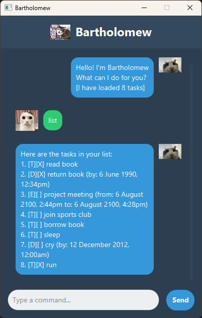

# Bartholomew User Guide



Bartholomew is a desktop chat application that helps you manage your tasks and deadlines. With its simple command-line interface, you can easily keep track of your to-do items, deadlines, and events.

## Features

### 1. Adding Tasks

#### 1.1 Adding a Todo Task

Add a simple task to your list.

Format: `todo DESCRIPTION`

Example: `todo read a book`

Expected output:

```
Got it. I've added this task: 
  [T][ ] read a book 
Now you have 1 task in the list.
```

#### 1.2 Adding a Deadline

Add a task with a specific deadline.

Format: `deadline DESCRIPTION /by DATE_TIME`

Example: `deadline complete assignment /by 2023-10-15 1800`

Expected output:
```
Got it. I've added this task: 
  [D][ ] complete assignment (by: Oct 15 2023, 6:00 PM)
Now you have 2 tasks in the list.
```

#### 1.3 Adding an Event

Add an event with a start and end time.

Format: `event DESCRIPTION /from START_TIME /to END_TIME`

Example: `event team meeting /from 2023-10-10 1400 /to 2023-10-10 1600`

Expected output:
```
Got it. I've added this task: 
  [E][ ] team meeting (from: Oct 10 2023, 2:00 PM to: Oct 10 2023, 4:00 PM) 
Now you have 3 tasks in the list.
```

### 2. Viewing Tasks

#### 2.1 Listing All Tasks

View all tasks in your list.

Format: `list`

Expected output:
```
Here are the tasks in your list:
1. [T][ ] read a book
2. [D][ ] complete assignment (by: Oct 15 2023, 6:00 PM)
3. [E][ ] team meeting (from: Oct 10 2023, 2:00 PM to: Oct 10 2023, 4:00 PM)
```

### 3. Managing Tasks

#### 3.1 Marking a Task as Done

Mark a task as completed.

Format: `mark TASK_NUMBER`

Example: `mark 1`

Expected output:
```
Nice! I've marked this task as done: 
  [T][X] read a book
```

#### 3.2 Unmarking a Task

Mark a completed task as not done.

Format: `unmark TASK_NUMBER`

Example: `unmark 1`

Expected output:
```
OK, I've marked this task as not done yet: 
  [T][ ] read a book
```

#### 3.3 Deleting a Task

Remove a task from your list.

Format: `delete TASK_NUMBER`

Example: `delete 2`

Expected output:
```
Noted. I've removed this task: 
  [D][ ] complete assignment (by: Oct 15 2023, 6:00 PM)
Now you have 2 tasks in the list.
```

### 4. Searching Tasks

#### 4.1 Finding Tasks by Keyword

Search for tasks containing specific keywords.

Format: `find KEYWORD`

Example: `find meeting`

Expected output:
```
Here are the matching tasks in your list:
1. [E][ ] team meeting (from: Oct 10 2023, 2:00 PM to: Oct 10 2023, 4:00 PM)
```

### 5. Exiting the Application

Close the application.

Format: `bye`

Expected output:
```
Bye. Hope to see you again soon
```

## Command Summary

| Command | Format | Example |
| ------- | ------ | ------- |
| **Add Todo** | `todo DESCRIPTION` | `todo read a book` |
| **Add Deadline** | `deadline DESCRIPTION /by DATE_TIME` | `deadline complete assignment /by 2023-10-15 1800` |
| **Add Event** | `event DESCRIPTION /from START_TIME /to END_TIME` | `event team meeting /from 2023-10-10 1400 /to 2023-10-10 1600` |
| **List** | `list` | `list` |
| **Mark Done** | `mark TASK_NUMBER` | `mark 1` |
| **Unmark** | `unmark TASK_NUMBER` | `unmark 1` |
| **Delete** | `delete TASK_NUMBER` | `delete 2` |
| **Find** | `find KEYWORD` | `find meeting` |
| **Exit** | `bye` | `bye` |

## Date-Time Format

For deadlines and events, use the following format:
- Date: DD/MM/YY (e.g. 12/12/2025)
- Time: 24-hour format (e.g., 1800 for 6:00 PM)

## Error Handling

Bartholomew will display an error message if:
- You enter an invalid command
- You provide an invalid task number
- Your date-time format is incorrect
- You forget to provide a description for a task